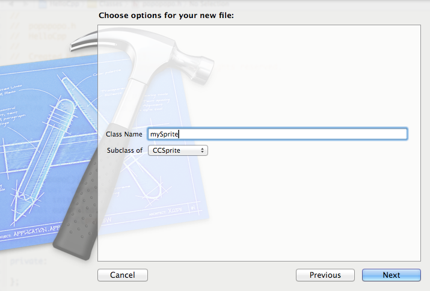

cocos2dx_xcode_file_template
============================
use "python install.py" do install templates automaticlly, it will delete this directory: /Users/ber/Library/Developer/Xcode/Templates/File Templates/cocos2dx, so back up if you need it.

or you can do this by yourself:
copy the cocos2dx folder to /Users/ber/Library/Developer/Xcode/Templates/File Templates

